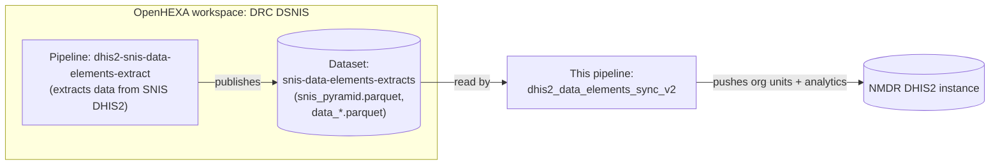

# dhis2_data_elements_sync_v2

OpenHEXA pipeline that synchronizes DRC SNIS data (organisation units and data
element analytics) to the NMDR DHIS2 instance. The data itself is extracted
from SNIS by a separate pipeline and shared as parquet files through an
OpenHEXA dataset — this pipeline only reads that dataset and pushes to DHIS2,
it does not extract from SNIS itself.

## Data source

## Overview of the workflow

1. **Change detection** — compares the latest version timestamp of the
   `snis-data-elements-extracts` dataset against the timestamp recorded in
   `config/last_update.json`. If nothing changed and `force_run` is `False`,
   the run is skipped entirely.
2. **Sync organisation units** *(toggle: `ou_sync`)* — downloads
   `snis_pyramid.parquet` from the dataset and aligns the target DHIS2's
   organisation unit tree to it, via `DHIS2PyramidAligner`.
3. **Push data elements** *(toggle: `push_analytics`)* — finds every file
   matching `data_*.parquet` in the dataset. For each file: applies the data
   element category/attribute option combo mapping rules
   (`apply_data_element_mappings`), sorts the result by `org_unit`, and pushes
   it to DHIS2 via `DHIS2Pusher`.
4. **Record progress** — once enabled steps succeed, the timestamp of the
   dataset version just processed is written to `config/last_update.json`, so
   the next run knows whether new data has arrived.

If any step raises an exception, the whole pipeline run fails (the error is
logged and re-raised).

## Parameters

| Parameter | Name (UI) | Type | Default | Description |
|---|---|---|---|---|
| `ou_sync` | Run org units sync | bool | `True` | Enable/disable the organisation units sync step. |
| `push_analytics` | Push data elements | bool | `True` | Enable/disable the data elements push step. |
| `force_run` | Force run | bool | `False` | Run even if no new dataset version was detected since the last run. |

## Configuration files

| File | Objective |
|---|---|
| `config/push_config.json` | Drives the pipeline's push behavior: DHIS2 connection/import settings and the data element category/attribute option combo mapping rules. |
| `config/last_update.json` | Bookkeeping file written by the pipeline itself, tracking the last processed dataset version — used only for the change-detection check in step 1. |

## Outputs

This pipeline's primary output is **data written live to the target DHIS2
instance** (organisation units and data element values) — it does not publish
files back to any OpenHEXA dataset. Secondary outputs, under
`workspace/pipelines/dhis2_data_elements_sync_v2/`:

| Path | Content |
|---|---|
| `logs/push_orgunits/`, `logs/push_data_elements/` | Per-task text logs of the run. |
| `cache/` | Cache used by the DHIS2 pusher to avoid resending previously-pushed values on later runs. |
| `config/last_update.json` | Updated with the timestamp of the dataset version just processed. |
