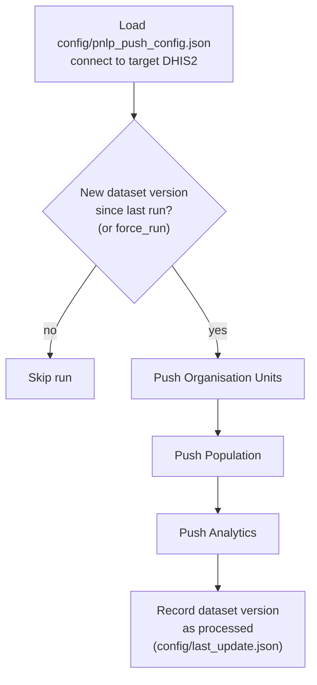

# dhis2_pnlp_push_v2

OpenHEXA pipeline that pushes DRC SNIS data (organisation units, population, and
routine analytics) to the PNLP DHIS2 instance ("NMDR"). The data itself is
produced by a separate extraction pipeline and shared as parquet files through
an OpenHEXA dataset (`SETTINGS.OPENHEXA_DATASET_ID`, e.g. `snis-extracts`) —
this pipeline only reads that dataset and pushes to DHIS2, it does not extract
from SNIS itself.

## Overview of the workflow

1. **Load configuration & connect** — reads `config/pnlp_push_config.json` and
   opens a connection to the target DHIS2 instance named in
   `SETTINGS.DHIS2_CONNECTION`.
2. **Change detection** — compares the latest version timestamp of the source
   OpenHEXA dataset (`SETTINGS.OPENHEXA_DATASET_ID`) against the timestamp
   recorded in `config/last_update.json`. If nothing changed and `force_run`
   is `False`, the run is skipped entirely (no data is pushed).
3. **Push Organisation Units** *(toggle: `push_orgunits`)* — downloads
   `snis_pyramid.parquet` from the dataset and aligns the target DHIS2's
   organisation unit tree to it (creates/updates org units so the target
   pyramid matches the source), via `DHIS2PyramidAligner`.
4. **Push Population** *(toggle: `push_pop`)* — finds every file matching
   `snis_population_*.parquet` in the dataset, fills missing category/attribute
   option combos with configured defaults, and pushes the values to DHIS2.
5. **Push Analytics** *(toggle: `push_analytics_task`)* — finds every file
   matching `snis_data_*.parquet` in the dataset. For each file:
   - Rows are split by `data_type` into `DATA_ELEMENT`, `REPORTING_RATE`, and
     `INDICATOR`, and each subset gets its own mapping rules (see below).
   - The three mapped subsets are recombined, sorted by `org_unit`, and pushed
     to DHIS2 as one batch.
6. **Record progress** — once all enabled steps succeed, the timestamp of the
   dataset version just processed is written to `config/last_update.json`, so
   the next run knows whether new data has arrived.

If any push step raises an exception, the whole pipeline run fails (the error
is logged and re-raised) — there's no partial-success/retry-only-the-rest
behavior.

### Analytics mapping rules (step 5 in detail)

| `data_type`      | Function                        | What it does |
|-------------------|----------------------------------|---------------|
| `DATA_ELEMENT`    | `apply_dataelement_mappings`     | See below — behavior differs for periods before/after `202501`, because SNIS changed its category-option-combo (COC) structure starting 2025. |
| `REPORTING_RATE`  | `apply_reporting_rate_mappings`  | Renames `(dx, rate_metric)` pairs to the specific data element uid DHIS2 expects, per year (`RATE_MAPPING["2024"]` / `["2025"]`), then fills missing COC/AOC with defaults. |
| `INDICATOR`       | `apply_acm_mappings`             | Renames All-Cause-Mortality (ACM) indicator uids, fills missing COC/AOC defaults, and casts `value` to an integer string (DHIS2 rejects decimals for this indicator). |

**Data element (`DATA_ELEMENT`) COC handling** — `apply_dataelement_mappings`
branches on the row's period:

- **Period ≥ `202501`** (`apply_dataelement_coc_mappings_2025`): for each data
  element listed in `MAPPINGS_2025.UIDS`, only rows whose COC is explicitly
  listed for that element are kept, then remapped to the new COC. Every other
  data element (not in `UIDS`) has its COC remapped via
  `MAPPINGS_2025.GENERAL_COC_MAPPINGS` if it matches. **Rows that match
  neither rule are dropped** — this function filters the extract, it doesn't
  just transform it.
- **Period < `202501`** (`apply_dataelement_coc_mappings_2024`, legacy path):
  fills missing COCs with a default, replaces any COC listed in `MAPPINGS`,
  then drops rows whose (possibly replaced) COC is in `IGNORE_MAPPINGS`.
- In both cases, `apply_dataelement_mappings` then fills any remaining missing
  `attribute_option_combo` with `ATTR_OPTION_COMBO.DEFAULT`.

## Parameters

| Parameter | Name (UI) | Type | Default | Description |
|---|---|---|---|---|
| `push_orgunits` | Push Organisation Units | bool | `True` | Enable/disable the organisation units push step. |
| `push_pop` | Push population | bool | `True` | Enable/disable the population push step. |
| `push_analytics_task` | Push analytics | bool | `True` | Enable/disable the analytics (data elements / reporting rates / indicators) push step. |
| `force_run` | Force run | bool | `False` | Run even if no new dataset version was detected since the last run. |

## Configuration (`config/pnlp_push_config.json`)

This file lives in the pipeline's OpenHEXA workspace storage (not committed to
git) and drives all pushing/mapping behavior.

### `SETTINGS`

| Key | Meaning |
|---|---|
| `DHIS2_CONNECTION` | Name of the OpenHEXA DHIS2 connection to push data to (the PNLP/NMDR target instance). |
| `OPENHEXA_DATASET_ID` | Source OpenHEXA dataset providing the pyramid/population/analytics parquet files. |
| `IMPORT_STRATEGY` | DHIS2 import strategy used for pushed data values (e.g. `CREATE_AND_UPDATE`). |
| `DRY_RUN` | If `true`, simulates the push without writing to DHIS2. |
| `MAX_POST` | Maximum number of data values sent per DHIS2 API request (batch size). |

### `POPULATION_MAPPING`

| Key | Meaning |
|---|---|
| `CATEGORY_OPTION_COMBO.DEFAULT` | COC id used to fill missing values in population extracts. |
| `ATTRIBUTE_OPTION_COMBO.DEFAULT` | AOC id used to fill missing values in population extracts. |

### `DATAELEMENT_MAPPING`

| Key | Meaning |
|---|---|
| `CAT_OPTION_COMBO.MAPPINGS_2025.UIDS` | `{ data_element_uid: { old_coc: new_coc, ... }, ... }`. For periods ≥ 202501: per-data-element allow-list + rename of COCs. |
| `CAT_OPTION_COMBO.MAPPINGS_2025.GENERAL_COC_MAPPINGS` | `{ old_coc: new_coc, ... }`. Applied to data elements **not** listed in `UIDS`, for periods ≥ 202501. |
| `CAT_OPTION_COMBO.MAPPINGS_2024.DEFAULT` | Fallback COC for periods < 202501. |
| `CAT_OPTION_COMBO.MAPPINGS_2024.MAPPINGS` | `{ old_coc: new_coc, ... }` renamed for periods < 202501. |
| `CAT_OPTION_COMBO.MAPPINGS_2024.IGNORE_MAPPINGS` | List of COC ids whose rows are dropped for periods < 202501. |
| `ATTR_OPTION_COMBO.DEFAULT` | AOC id used to fill missing values, applied regardless of period. |

> Note: `CAT_OPTION_COMBO.DEFAULT` (top level, sibling of `MAPPINGS_2025`/`MAPPINGS_2024`) is present in the config but not currently read by the code — the effective defaults are the nested `MAPPINGS_2024.DEFAULT` and `ATTR_OPTION_COMBO.DEFAULT` keys above.

### `RATE_MAPPING`

| Key | Meaning |
|---|---|
| `"2024"` / `"2025"` | `{ data_element_uid: { rate_metric: new_data_element_uid, ... }, ... }`. Renames a `(dx, rate_metric)` pair to the target uid DHIS2 expects, per year. `rate_metric` values seen in the data: `REPORTING_RATE`, `REPORTING_RATE_ON_TIME`, `ACTUAL_REPORTS`, `ACTUAL_REPORTS_ON_TIME`, `EXPECTED_REPORTS`. |
| `CAT_OPTION_COMBO.DEFAULT` | COC id filled in for every reporting-rate row (no per-element logic here). |
| `ATTR_OPTION_COMBO.DEFAULT` | AOC id filled in for every reporting-rate row. |

### `ACM_INDICATOR_MAPPING`

| Key | Meaning |
|---|---|
| `UIDS` | `{ old_indicator_uid: new_indicator_uid, ... }` rename map for ACM indicators. |
| `CAT_OPTION_COMBO.DEFAULT` | COC id used to fill missing values. |
| `ATTR_OPTION_COMBO.DEFAULT` | AOC id used to fill missing values. |

### `config/last_update.json`

Bookkeeping file **written by the pipeline itself** (not meant to be edited by
hand): `{"LAST_UPDATE": "<YYYYMMDD_HHMM>"}`, the timestamp of the last source
dataset version successfully processed. Used only for the "new data detected"
check in step 2 above.

## Outputs

This pipeline's primary output is **data written live to the target DHIS2
instance** — it does not publish files back to any OpenHEXA dataset. Secondary
outputs, all under `workspace/pipelines/dhis2_pnlp_push_v2/`:

| Path | Content |
|---|---|
| `logs/push_orgunits/`, `logs/push_population/`, `logs/push_analytics/` | Per-task text logs of the push run (one file per run). |
| `cache/push_population/`, `cache/push_analytics/` | Cache used by the DHIS2 pusher to avoid resending previously-pushed values on later runs. |
| `config/last_update.json` | Updated with the timestamp of the dataset version just processed (see above). |

## Expected input data (source dataset)

| File pattern | Used by | Key columns |
|---|---|---|
| `snis_pyramid.parquet` | Push Organisation Units | Org unit hierarchy (`id`, `name`, `shortName`, `openingDate`, `parent`, ...). |
| `snis_population_*.parquet` | Push Population | `org_unit`, `category_option_combo`, `attribute_option_combo`, `value`, ... |
| `snis_data_*.parquet` | Push Analytics | `data_type` (`DATA_ELEMENT` / `REPORTING_RATE` / `INDICATOR`), `dx`, `period`, `org_unit`, `category_option_combo`, `attribute_option_combo`, `value`, `rate_metric` (for `REPORTING_RATE` rows only). |
