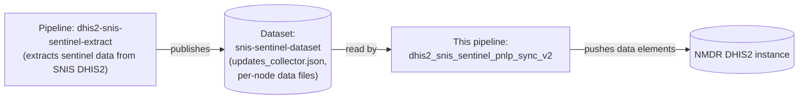

# dhis2_snis_sentinel_pnlp_sync_v2

OpenHEXA pipeline that synchronizes DRC SNIS sentinel site data element
analytics to the NMDR DHIS2 instance. The data itself is extracted from SNIS
by a separate pipeline and shared as files through an OpenHEXA dataset — this
pipeline only reads that dataset and pushes to DHIS2, it does not extract from
SNIS itself.

## Data source

## Overview of the workflow

1. **Change detection** — compares the latest version timestamp of the
   `snis-sentinel-dataset` dataset against the timestamp recorded in
   `config/last_update.json`. If nothing changed and `force_run` is `False`,
   the run is skipped entirely.
2. **Push data elements** *(toggle: `push_analytics`)* — reads
   `updates_collector.json` from the dataset, which lists, per sentinel node,
   the files that need pushing. For each node:
   - Looks up that node's extract configuration (`DATA_ELEMENTS.EXTRACTS`,
     matched by `EXTRACT_UID`) in `config/push_config.json`; nodes without a
     matching configuration are skipped.
   - For each listed file: applies the node's category/attribute option combo
     mapping rules and data element uid renames
     (`apply_data_element_mappings` — note this also filters out rows whose
     COC/AOC isn't part of the mapping), sorts the result by `org_unit`, and
     pushes it to DHIS2 via `DHIS2Pusher` (with a per-node cache).
3. **Record progress** — once the push step succeeds, the timestamp of the
   dataset version just processed is written to `config/last_update.json`, so
   the next run knows whether new data has arrived.

If any step raises an exception, the whole pipeline run fails (the error is
logged and re-raised).

## Parameters

| Parameter | Name (UI) | Type | Default | Description |
|---|---|---|---|---|
| `push_analytics` | Push data elements | bool | `True` | Enable/disable the data elements push step. |
| `force_run` | Force run | bool | `False` | Run even if no new dataset version was detected since the last run. |

## Configuration files

| File | Objective |
|---|---|
| `config/push_config.json` | Drives the pipeline's push behavior: DHIS2 connection/import settings and, per sentinel node, the data element category/attribute option combo mapping and uid rename rules. |
| `config/last_update.json` | Bookkeeping file written by the pipeline itself, tracking the last processed dataset version — used only for the change-detection check in step 1. |

## Outputs

This pipeline's primary output is **data written live to the target DHIS2
instance** — it does not publish files back to any OpenHEXA dataset. Secondary
outputs, under `workspace/pipelines/dhis2_snis_sentinel_pnlp_sync_v2/`:

| Path | Content |
|---|---|
| `logs/push_data_elements/` | Per-task text logs of the push run. |
| `cache/<node>/` | Per-node cache used by the DHIS2 pusher to avoid resending previously-pushed values on later runs. |
| `config/last_update.json` | Updated with the timestamp of the dataset version just processed. |
